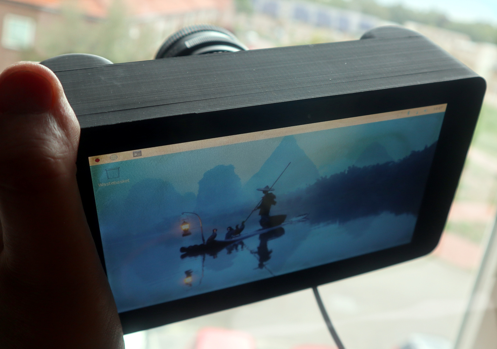
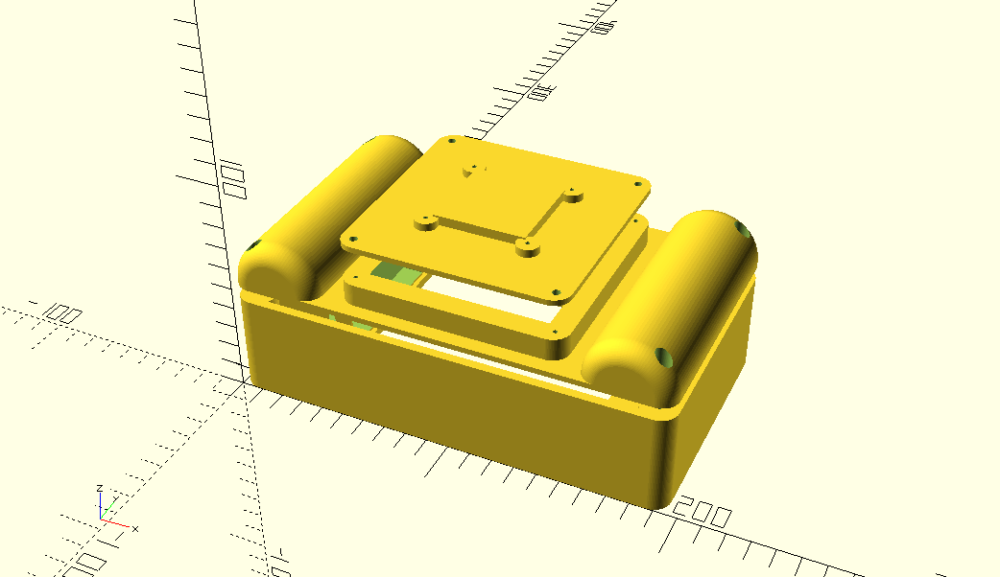

# A camera enclosure for the 1st gen Rpi 7" touch screen, with interchangeable camera modules

Jenny List 2025
CC-BY-SA 4.0

## About

I need a camera mule, on which to test experimental digital camera designs. I had an RPi 4 and a 1st-gen Pi 7" touch screen, so I've made this camera enclosure. Think of it as a very chunky 7" tablet with a mounting on the rear for a modular 3D printed camera carrier. As shipped, it comes with a module for the RPi HQ camera.

For my needs it doesn't come with a battery, it will always be used in a static situation or as part of a rig  where USB-C power is available.

## You Will Need:

Prints of the following modules from 7-inch-camera.scad. Use full supports and a brim.
1. cameraChassis()
2. cameraGripPanel()
3. HQCameraFrontPlate()

A print of the contents of camera-collar.scad. Use full supports and a brim.

A Pi 1/2/3/4 model B+

A 1st gen 7" Raspberry Pi touch screen and mounting kit.

4 M3 screws for the screen.

Assorted self-tapping screws for assembly.

## To Assemble:

The parts appear as follows:

The diagram above shows how the parts locate, though the HQ camera front plate is shown upside down as it is printed. It's suggested you mount the Pi to the display first using the included mounting kit and making sure it all works, before mounting the assembly to the chassi with four M3 screws. Then mount the grip panel to the back with four self-tapping screws. You should be able to see the Pi through a 100mm by 100mm opening in the front, this should be enough to attach the camera cable from your front place, and assemble the whole thing with more self-tapping screws.

The camera front plate as distributed is for the HQ camera. It attaches to the front with four self-tappers, with its rear electronics in the enclosure and the cable passing through the slot. The camera collar fits on top of the camera and is secured with four moew screws, supporting and protecting the module while allowing space for lens attachment.

## Software

Any RPi camera software shopuld be find with this, as long as it supports whatever camera module you are using. I'm trying this: (https://github.com/Gordon999/RPiCamGUI).

## Licence

This model is licensed under the [Creative Commons Attribution Share Alike 4.0 International licence](license.md).

